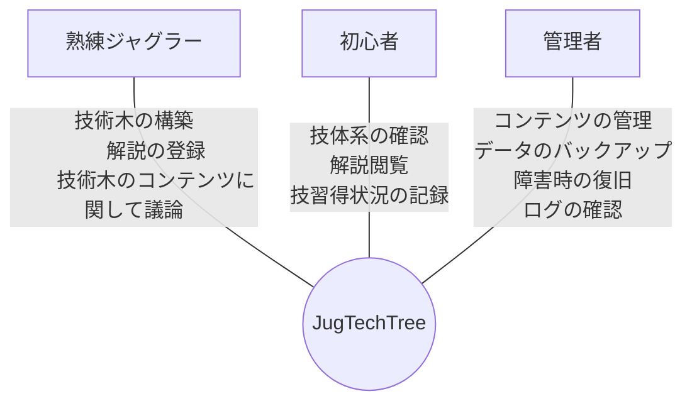

# JugTechTree全体像

```mermaid
graph TD;
    M[熟練ジャグラー] -- 技術木の構築
        解説の登録
        技術木のコンテンツに関して議論 --- J((JugTechTree));
    B[初心者] -- 技体系の確認
        解説閲覧 
        技習得状況の記録 --- J((JugTechTree));
    A[管理者] -- コンテンツの管理
        データのバックアップ
        障害時の復旧
        ログの確認 --- J((JugTechTree));
```