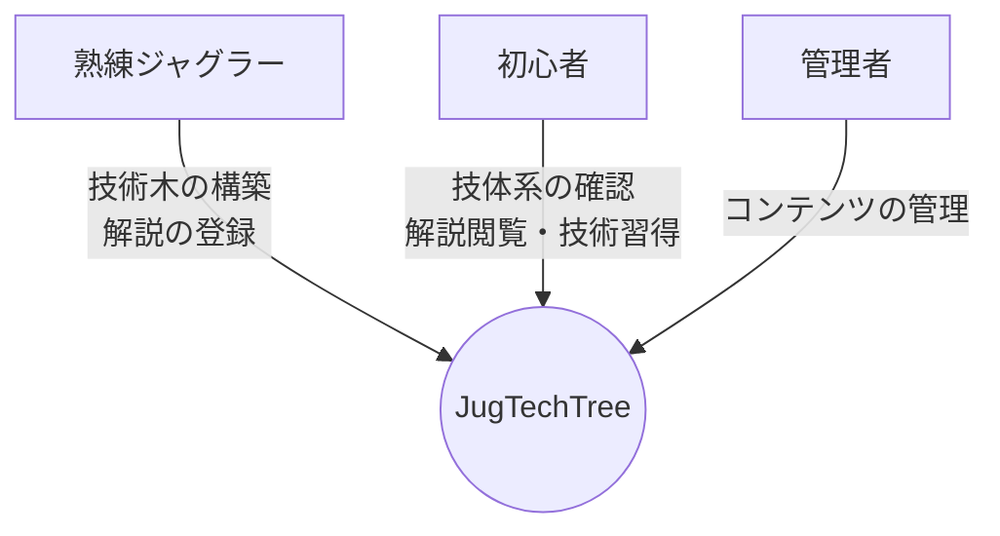

# JugTechTree全体像

```mermaid
graph TD;
    M[熟練ジャグラー] -- 技術木の構築<br>解説の登録 --> J((JugTechTree));
    B[初心者] -- 技体系の確認<br>解説閲覧・技術習得 --> J((JugTechTree));
    A[管理者] -- コンテンツの管理 --> J((JugTechTree));
```