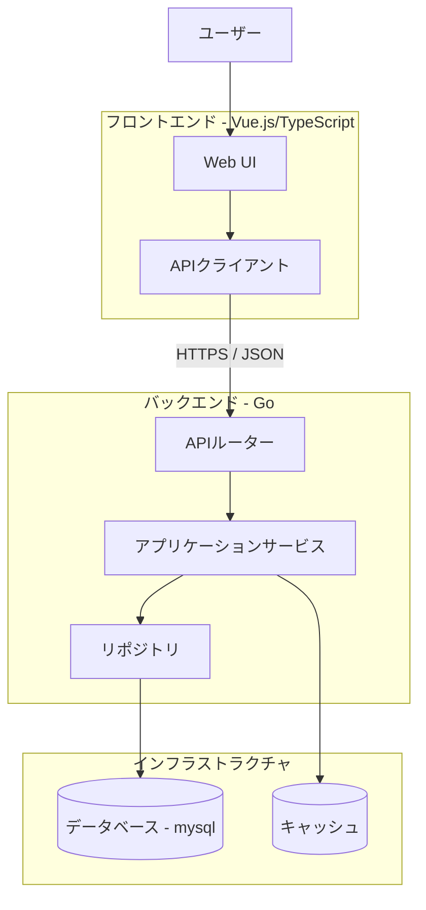

# JugTechTreeソフトウェアアーキテクチャ

```warn
アーキテクチャ設計に関する知識がAmuzakにはないため将来的に変更する可能性あり
```



```mermaid
flowchart TB
    User["ユーザー"]

    subgraph Frontend["フロントエンド - Vue.js/TypeScript"]
        UI["Web UI"]
        Client["APIクライアント"]
        UI --> Client
    end

    subgraph Backend["バックエンド - Go"]
        Router["APIルーター"]
        App["アプリケーションサービス"]
        Repo["リポジトリ"]
        Router --> App
        App --> Repo
    end

    subgraph Infrastructure["インフラストラクチャ"]
        DB[("データベース - mysql")]
        Cache[("キャッシュ")]
    end

    User --> UI
    Client -->|"HTTPS / JSON"| Router
    Repo --> DB
    App --> Cache


```